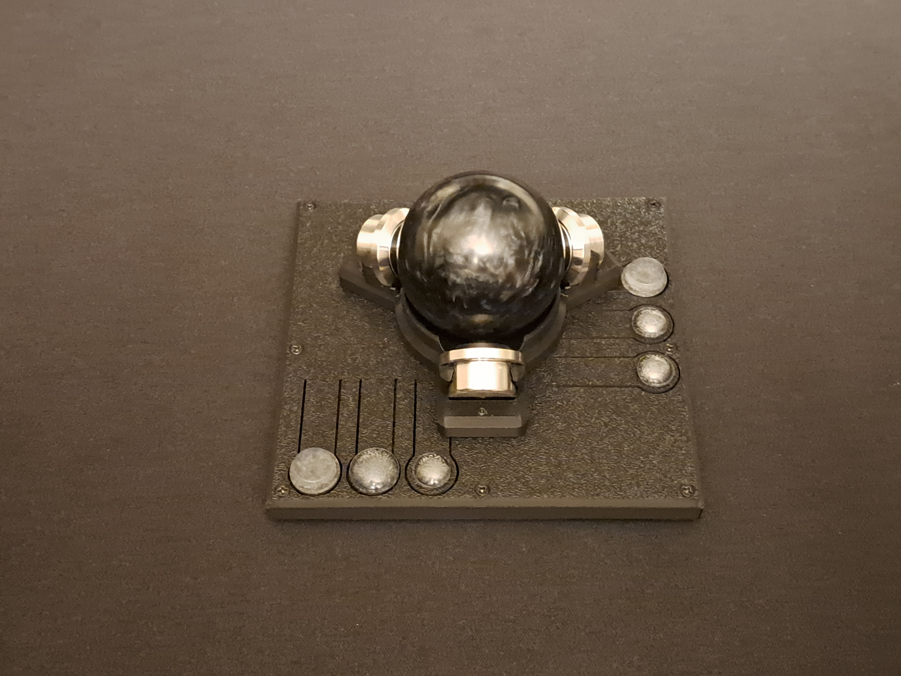

You have reached my fork of the [Main Ploopy Adept Trackball repository](https://github.com/ploopyco/adept-trackball), where you will find my Minimal Case Mod.  As these are just hardware modification to the existing Adept internals, all files will be located in the [Hardware/mechanicals-minimal-mod](https://github.com/MrGrumpyMcGrumpster/adept-trackball-minimal-mod/tree/master/hardware/mechanicals-minimal-mod) folder.

Best of luck!
