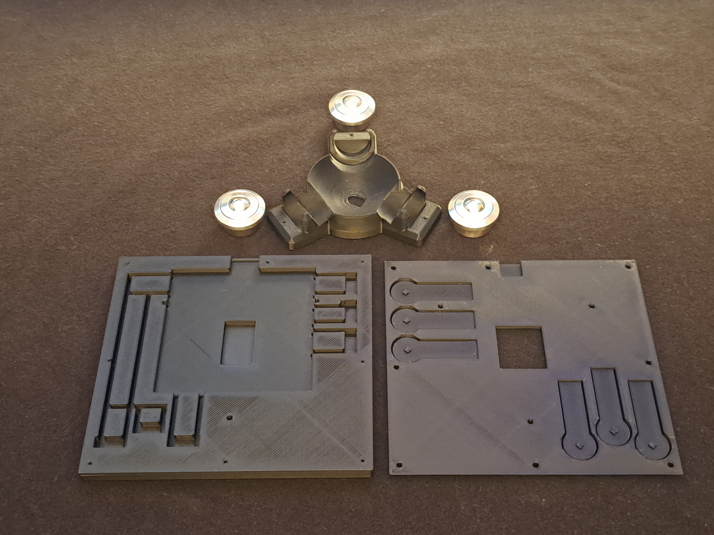
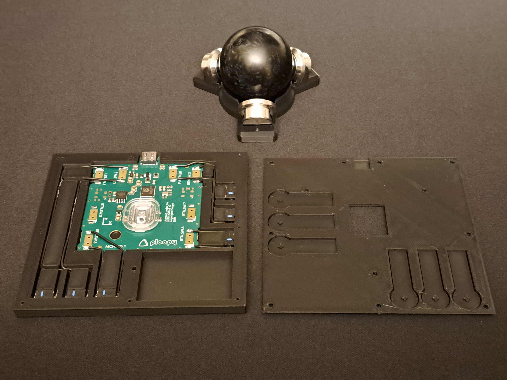

# The Ploopy Adept Trackball Minimal Mod

This is the home of the "Minimal" case and board modification for the Ploopy Adept trackball.  I couldn't get
a comfortable hand position, so I created a new case and repositioned the buttons so I can reach them all
without having to move my hand.

While I was at it, I decided to try some different bearings.  Of the ones I've tried, the SP12 BTUs found on
Aliexpress worked the best (so far).  They're fairly smooth, and the noise wasn't excessive for my environment (though
still probably too loud for most).  High quality steel MR105 roller bearings at an 80 degree angle are the next
best.  85 degrees would be even better, but the plate from a 3d printer is just too flexible.  A CNC machined
aluminum mount might be ideal.  Perhaps I'll test that in the future.

Please be advised that you will have to remove the 6 switches from the Adept board.  Soldering is required!
You should really have some extra Omron D2LS-21 switches as using the existing ones after desoldering them
can be hit or miss.  You'll also need to cut the two little locating nubs off the bottom of the switch.  They
should simply push right into the bottom plate.  

Full instructions coming soon, but the images are all you need to figure it out.

Materials Needed:

  1) Ploopy Adept internals.  Please see the main [Ploopy Adept repository](https://github.com/ploopyco/adept-trackball).
  2) Extra Omron D2LS-21 switches highly recommended!
  3) 30 AWG stranded connection wire
  4) Soldering equipment, solder, etc...
  5) [SP12 BTUs](https://www.aliexpress.com/item/1005008220158916.html?spm=a2g0o.order_list.order_list_main.23.18df1802t6H6VG) : I believe most of the generic SP12 BTUs on Aliexpress are the same, but be aware that there are higher priced stainless steel versions.
  6) High quality MR105 roller bearings.  High tolerance Hybrid Ceramic MR105 with a steel outer case seem to work the best.  Full ceramics make too much noise.
  7) Black countersunk screws (8 M2x8mm and 3 M2x16mm).  A [set like this](https://www.amazon.ca/dp/B07NZ3VSFX) is quite useful...
  8) [Rubber Antislip Dots](https://www.amazon.ca/dp/B0BZBXJ5Y8?th=1) for button tops and a non-slip base.  Different shapes for different primary buttons help with feel.
  9) A 3D Printer.
  10) A high quality 44mm ultra smooth trackball is ideal for roller bearings, but the 45mm stock ball works fine especially with the SP12 BTUs.
